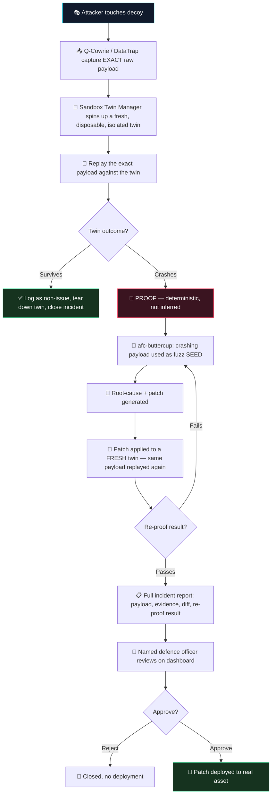

# TrapNet-CRS (Chakravyuh)

### Deception-Triggered Autonomous Vulnerability Patching

**Prove the exploit before you fix the exploit.**
*A honeypot that doesn't just watch attackers — it uses them to heal the real system, before they ever reach it.*

*Built for the Indian Army Terrier Cyber Quest 2026 — AI Kavach Track*

[](LICENSE)
[]()
[]()

---

## 🎯 What Problem This Solves

| Without TrapNet-CRS | With TrapNet-CRS |
|---|---|
| Honeypots log attacker behavior — the intelligence dies in a log file | Attacker behavior becomes the **trigger** for automatic real-asset defense |
| Vulnerability scanners *infer* where a weakness might be | The system **proves** exploitability by replaying the real attack on a disposable twin |
| Manual patch pipelines take days to weeks | Detect → prove → patch → verify happens in **minutes**, with a human approving the final step |
| Centralized tools (SOC dashboards, cloud scanners) can't reach embedded/air-gapped systems | Runs fully local — designed for exactly the assets centralized tools can't touch |

**In one sentence:** when an attacker attacks a decoy, we replay their *exact* payload against a
disposable clone of the real asset — if the clone breaks, that's proof, and we patch the real thing
before the attacker ever gets there.

---

## 🏗️ Wireframed Architecture

```
                                    ┌────────────────────────────────────┐
                                    │            DASHBOARD (React)          │
                                    │  ┌──────────┐  ┌──────────┐            │
                                    │  │ Network  │  │ Live      │            │
                                    │  │ Map      │  │ Event Feed│            │
                                    │  └──────────┘  └──────────┘            │
                                    │  ┌──────────┐  ┌──────────┐            │
                                    │  │ Pipeline │  │ Diff      │            │
                                    │  │ Status   │  │ Viewer    │            │
                                    │  └──────────┘  └──────────┘            │
                                    │       [ Approve ]  [ Reject ]           │
                                    └──────────────────▲───────────────────────┘
                                                        │ WebSocket / REST
                                    ┌──────────────────┴───────────────────────┐
                                    │        BACKEND ORCHESTRATOR (FastAPI)       │
                                    │  • Incident state machine (SQLite)           │
                                    │  • Audit trail (who approved, when)          │
                                    │  • Incident report generator                 │
                                    └──────┬───────────────────────────┬──────────┘
                       events (Redis)      │                           │  tasks / status
              ┌────────────────────────────▼──┐          ┌─────────────▼──────────────────┐
              │        DECEPTION LAYER           │          │     SANDBOX TWIN MANAGER          │
              │  ┌───────────┐  ┌─────────────┐   │          │  1. spin up disposable twin        │
              │  │ Q-Cowrie   │  │ DataTrap     │   │          │     (isolated Docker network)      │
              │  │ (RL-       │  │ (dd-honeypot,│   │─events──▶│  2. replay EXACT captured payload  │
              │  │ adaptive   │  │ LLM+dataset  │   │          │  3. observe: crash or survive?      │
              │  │ SSH)       │  │ decoy resp.) │   │          └─────────────┬──────────────────────┘
              │  └───────────┘  └─────────────┘   │                        │
              │   fake-plc-01     fake-admin-panel │              ┌─────────┴─────────┐
              └────────────────────────────────────┘              │                   │
                                                          survives │                   │ compromised
                                                                   ▼                   ▼
                                                          ┌────────────────┐  ┌──────────────────────┐
                                                          │  Log & Close     │  │   CRS LAYER              │
                                                          │  (common,        │  │   afc-buttercup            │
                                                          │  healthy case)   │  │   • seeded fuzz (payload    │
                                                          └────────────────┘  │     as fuzz seed, not blind) │
                                                                               │   • root-cause + patch gen   │
                                                                               │   • regression verify         │
                                                                               │   via Minikube                │
                                                                               └──────────┬────────────────────┘
                                                                                          │ patch, on approval
                                                                               ┌──────────▼────────────────────┐
                                                                               │  Real Asset Codebase            │
                                                                               │  (re-verified on a FRESH twin   │
                                                                               │  before deploy — never touched  │
                                                                               │  by attacker traffic directly)  │
                                                                               └──────────────────────────────────┘

  ISOLATION BOUNDARIES (enforced, not assumed):
  ├── Decoy  ↔  Real Asset      → NO route. Decoy is a lookalike, not a gateway.
  ├── Sandbox Twin ↔ everything → Dedicated isolated network. No internet, no decoy, no real-asset route.
  └── Real Asset ↔ pipeline     → Only a human-approved, re-verified patch diff ever reaches it.
```

---

## 🔄 How It Works — Pipeline Stages



**Stage-by-stage:**

1. **Deceive** — Q-Cowrie (Cowrie + reinforcement learning, so decoy responses adapt across a session
   instead of replaying scripted output) and DataTrap (ThalesGroup's `dd-honeypot`, attack-dataset +
   LLM-generated realistic decoy responses) sit alongside real assets. Anything touching them is
   inherently out-of-place — no legitimate user has a reason to reach an unadvertised decoy.
2. **Capture** — the *exact* payload is recorded, not a summary or classification of it.
3. **Clone** — a fresh, single-use, network-isolated twin of the real asset's software stack is
   spun up on demand.
4. **Replay & Prove** — the exact payload is fired at the twin. A crash here is deterministic proof,
   not a probability score.
5. **Seed & Patch** — afc-buttercup (Trail of Bits — 2nd place, DARPA AIxCC Finals 2025) uses the
   proven-crashing payload as a fuzzing seed, dramatically cutting time-to-patch versus a cold-start
   fuzzing campaign.
6. **Re-Prove** — the patch is applied to one more fresh twin and the *same* payload replayed again.
   Only a survive here counts as verified.
7. **Report & Approve** — a full incident report (attacker source, payload, twin evidence, patch diff,
   re-proof result) is generated and routed to the named responsible officer, who approves before
   deployment. **No patch is ever auto-deployed.**

---

## 🚀 Quick Start

```bash
# Clone the repository
git clone https://github.com/hsay123/Chakravyuh.git
cd Chakravyuh

# --- Phase 1: bring up the CRS (afc-buttercup) ---
cd afc-buttercup
minikube start
make setup-local
make deploy-local
# Sanity check: run the built-in known-vulnerable sample target first
make send-libpng-task

# --- Phase 2: bring up honeypots + correlation + backend + dashboard ---
cd ..
cp .env.example .env        # fill in your own API keys — never commit real values
docker compose -f docker-compose.yml up -d

# Check everything is healthy
docker compose ps
curl http://localhost:8001/health        # backend-orchestrator
curl http://localhost:8100/health        # correlation-engine
open http://localhost:3001               # dashboard
```

**Ports at a glance:**

| Service | Port | Purpose |
|---|---|---|
| Dashboard | `3001` | Operator UI — network map, event feed, approve/reject |
| Backend Orchestrator | `8001` | FastAPI — incident state machine, audit log |
| Correlation Engine health | `8100` | Liveness check for the correlation/twin-trigger service |
| DataTrap SSH decoy | `2223` | Fake SSH-exposed asset |
| DataTrap HTTP decoy | `8081` | Fake HTTP-exposed asset |
| Mock Competition API | `31323` | Local stand-in for AIxCC's competition task-server |
| Trapnet Redis | `6380` | Event stream — honeypot events → correlation engine |
| CRS Redis | `6379` | afc-buttercup's own internal task queue |

---

## 🧩 Component Reference

| Layer | Tool | Role |
|---|---|---|
| **Deception** | [Q-Cowrie](#) | RL-adaptive honeypot — decoy responses shift based on observed attacker behavior |
| **Deception** | [DataTrap (dd-honeypot)](https://github.com/ThalesGroup/dd-honeypot) | LLM+dataset-driven decoy for non-SSH services (fake PLC/admin panel) |
| **Isolation** | Sandbox Twin Manager *(custom)* | Spins up/tears down single-use, network-isolated twins per incident |
| **Patch Engine** | [afc-buttercup](https://github.com/trailofbits/afc-buttercup) | Seeded fuzzing, static/dynamic analysis, LLM patch generation, regression verification |
| **Correlation** | *(custom, Python)* | Config-driven asset registry mapping decoy → real asset → twin image |
| **Backend** | FastAPI + SQLite + WebSocket | Incident state machine, audit trail, report generation |
| **Frontend** | React + Vite + Tailwind | Live dashboard — network map, diff viewer, approve/reject console |

---

## 🔐 Hard Rules (non-negotiable, enforced throughout the build)

- ❌ **No mocked/dummy data** anywhere in the working system — every event must come from a real
  honeypot session and a real afc-buttercup run.
- ❌ **No auto-deployment** of a patch without explicit human approval, logged in the audit trail.
- ✅ **Attacks only against self-hosted, isolated, intentionally-vulnerable targets** that we own —
  never against third-party or production infrastructure.
- ✅ **Scope discipline**: memory-safety C/C++ vulnerability classes only (buffer overflow,
  use-after-free, out-of-bounds read/write) — reliability over breadth.
- ✅ **Fully local**: Docker + Minikube, no dependency on external cloud accounts beyond the LLM API
  calls afc-buttercup itself needs.

---

## 📊 Pipeline State Machine

```
DETECTED → TWIN_SPAWNED → REPLAYING ──▶ TWIN_SURVIVED → CLOSED
                                   │
                                   └──▶ TWIN_COMPROMISED → SEEDED_FUZZING → PATCH_GENERATED
                                          → RE_VERIFYING_ON_FRESH_TWIN → AWAITING_APPROVAL
                                          → APPROVED → RE_PROOF_ON_PATCHED_TWIN → DEPLOYED
                                                                  │
                                                                  └──▶ REJECTED
```

Most incidents should resolve at `TWIN_SURVIVED` within seconds — that's the expected, healthy
majority case. Only a genuine `TWIN_COMPROMISED` result proceeds down the full patch pipeline.

---

## 📁 Repository Structure

```
Chakravyuh/
├── afc-buttercup/              # Cloned CRS repo (Trail of Bits) — fuzz/patch/verify engine
│   ├── compose-trapnet.yaml
│   └── litellm/litellm_config.yaml   # env-var referenced, never hardcoded
├── correlation-engine/
│   └── app/
│       ├── main.py             # Redis consumer, protobuf patch parser, twin trigger logic
│       ├── buttercup_client.py # multipart task submission to afc-buttercup
│       └── redis_consumer.py   # honeypot event stream consumer
├── backend-orchestrator/
│   └── app/
│       ├── main.py             # FastAPI app, WebSocket push
│       ├── database.py         # SQLite, state transitions
│       └── models.py           # Incident state machine definitions
├── dashboard/                  # React + Vite + Tailwind frontend
├── docker-compose.yml          # Integration compose: redis, datatrap, event-adapter,
│                                #   correlation-engine, backend-orchestrator, dashboard
├── .env.example                # Placeholder values only — copy to .env, never commit .env
├── PRD.md                      # Requirements, scope, milestones
├── ARCHITECTURE.md             # Full component + data-flow spec
├── DESIGN.md                   # State machine, API contracts, dashboard layout
└── CLAUDE.md                   # Binding build instructions for AI coding agents
```

---

## 🆚 Why This Is Different From a Normal Honeypot

| | Classic Honeypot | TrapNet-CRS |
|---|---|---|
| Trigger | Attacker interaction, logged | Attacker's *exact payload*, replayed |
| Certainty | N/A — no follow-up action | Deterministic proof (twin crash) |
| Real-asset action | None | Autonomous patch, human-approved |
| Evidence delivered | Log entry | Proof-of-exploit + proof-of-fix report |

---

## 🛡️ Responsible Use

Every exploit, fuzz run, and patch verification in this project targets **self-hosted, disposable,
intentionally-vulnerable sample code** — never production systems, third-party infrastructure, or
anything outside an isolated lab network. This is defensive tooling: it exists to close vulnerabilities
faster than an attacker can exploit them, with a human in the loop at every irreversible step.

---

*Developed for the Indian Army Terrier Cyber Quest 2026 — AI Kavach Track*
